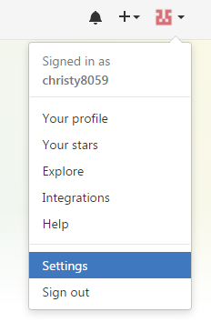
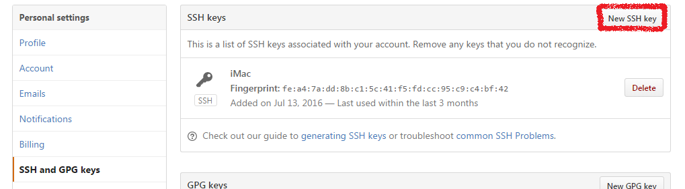
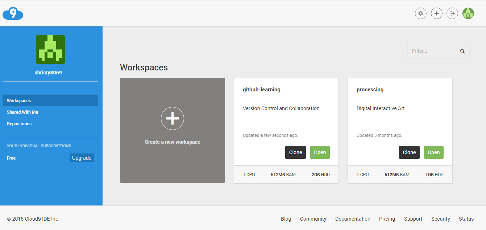
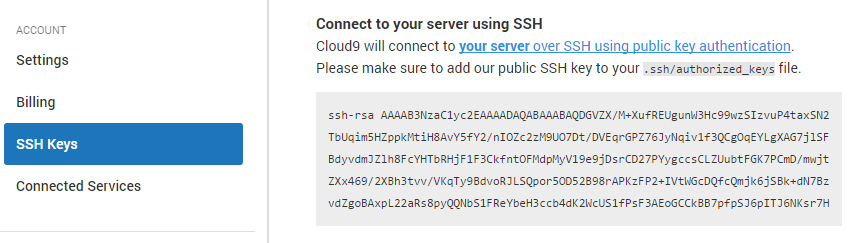
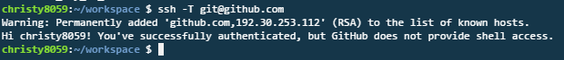
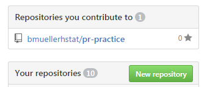
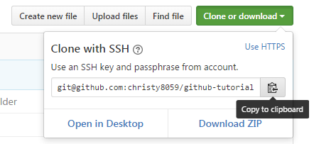

# GitHub Tutorial

_by Christy Li_

---
## Git vs. GitHub
_Git_ is a version control that keeps "snapshots" of your code, while _Github_ stores your code in the cloud. Since the code is stored on the cloud we are able to visually track changes. Also we're able to collaborate on the same project.   
* The difference is that _Git_ does not require github, but _github_ requires git.  

---

## Initial Setup  
**_Making a Github account_**   
If you already have a github account you may skip steps 1-3    
1. To make an account you need to go to [github.com](https://github.com/)  
2. Then you press on the green button that says "sign up".   
3. Then it redirects you to a page where you can type in a user name, email and password.   

**_Creating an SSH key between Github and C9_**  
_NOTE_ : These steps are only done ONCE after you make your _Github_ account. 

1. On Github go to the top right, and press on your profile icon     
2. Then press "settings".  
      
3. On the left there are different options. Press "SSH and GPG keys" which is the sixth one counting from the top. And then press "new SSH Key".  
   
4. Then you name it cloud9 for the title section.  
5. Then to get the SSH Key you would have to go back to your cloud9 tab (the page where you choose which workspace to open).    
6. On the top right, press the gear icon. After you have pressed the gear icon you should see "SSH Key" on the left.  
7. Copy everything that is in that gray box, and then go back to github and paste everything on the section that says Key.     
8. Then press add SSH Key.  
9. To check if it works you can open to your workspace and in the terminal type "ssh -T git@github.com". It should respond back saying "hi <your username>! You successfully...."  
  

---
## Repository Setup 
_To make a repository on C9_   
1. Open your terminal and double check if your in your workspace.      
2. Then in the terminal type `mkdir` (make directory) to make a new repo.   
3. Then `cd` (change directory) into the folder that.
4. You would have to initalize the repository. Therefore you type `git init`.  
    * Lets say you initalized it in the wrong place. To undo that you can type `rm -rf .git`.  
5. After you make the folder you can create a file using `touch.txt`.  
6. To open the file you can type `c9 file name` and you can start typing in the file.   
7. After you make your changes you'll need to add to your work to the staging area by typing `add .`.   
8. After you add to the staging are you would want to commit your work. (Meaning to actually take the snapshot of your staging area) You would type `commit -m "message"`. The -m just means message.
9. After commiting you push it to github using `git push`, but since you're not connected to your github you would have to connect it first. (only if you made a repo on Github already)  
10. To connect them you would type `git remote add origin git@github.com:username/nameofrepo.git` and then
`git push -u origin master`.     
10. Afterwards you can go back to your shell and type `git push`, and it will push it to github. 

_To make a repository on Github_  
1. On the home page of github you will see a green button that says "new repository"    
2. Then you type the name of the repo (exactly how it is on C9) For example: if its "first-repo" on cloud9, you would put "first-repo" on github.

---
## Workflow & Commands
Tips-   
1. If you are lost and not sure if you add and/or commited your work you can use `git status`.   
    *If its red it means its not commited or added
    *If its green that means it can mean that its added but not necessary commited. Usually if you read back what they respond it will say "changes to be commited". This just means that you added it to your staging area and didnt commit it yet.  
2. To keep track of your work you should add and commit as often as possible
    * Adding means to take a snap shot and add it to your staging area. 
    * committing means to actually "take the picture" and add a brief message for other so they know what you did. 
3. After commiting you would want to push it to github.
    * pushing just means to send it to github, so github can keep track of your changes.     

_**Remeber** : These steps should be done as frequently as possible_  

---   
## Collaboration  
Sometimes we want to give other people our opinion or make changes and edits, but how can we do that ? Yes..... we can _Fork_ their repository.  

_Forking and cloning_ just means making a copy of their repository from the cloud and making it our own. How do we do this ?  

1. First, we will have to _fork_ their repository on Github. On the top right theres a button that says _fork_.   
2. After you press fork you should see  
original repo:       after you forked it:   
3. Next you clone or download it you your local repo. To do that you simply press the "clone or download" button. Then theres this clipboard on the left of it. You press it and it will automatically copy it for you.  
4. Then go to you c9 and type `git clone`with the link and then press enter. You will see the file appear on the sidebar. 
5. And to make changes or edit you'll need to `cd` into the folder/repo (change directory), and then `c9` with file name.
6. Let's say you've made changes to a specific file, you'll need to add, commit and push. Remember this is going to be pushed to your copy of their repo. It will not automatically change on the orginal repository. 
7. After you finish fixing any changes you may send a pull request.  
 then:    
